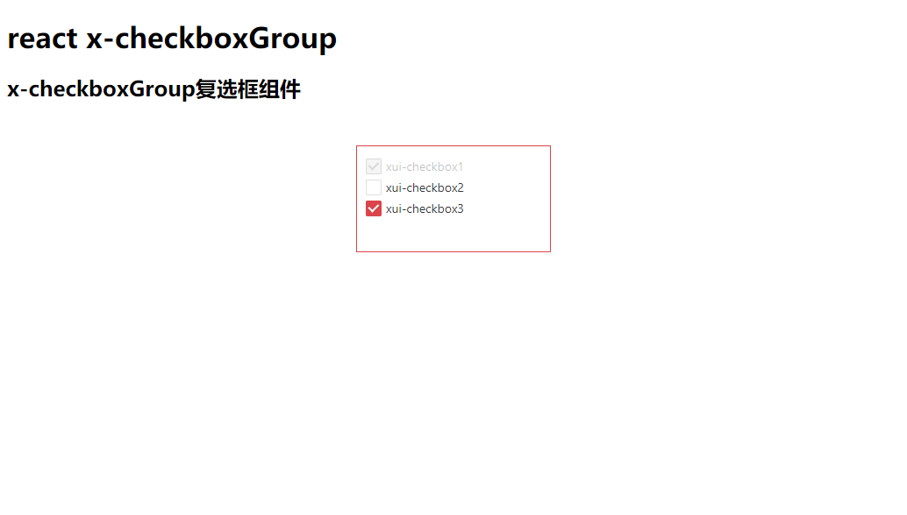

# x-paging
react复选框组件x-checkboxGroup，它依赖于x-checkbox组件，主要是可添加复选框组.
# npm
    npm install --save x-checkboxGroup
# 效果图

# 使用方式
```
  render() {
    return (
      <div>
       <CheckboxGroup options={opt} defaultValue={["Y"]} onChange = {this.onChangeFunc}><CheckboxGroup/>
      </div>
    )
  }
```

# API
## options
生成复选框组参数
## defaultValue
默认选中复选框
## onChange
复选框组checked值发生改变触发事件，以数组形式返回选中复选框的值。

### 关于作者
[https://github.com/luo-xzp](https://github.com/luo-xzp)

### 组件github地址
[https://github.com/react-xui/x-checkboxGroup](https://github.com/react-xui/x-checkboxGroup)

### xui
react xui组件一直在持续更新中，欢迎大家关注[https://github.com/react-xui](https://github.com/react-xui)